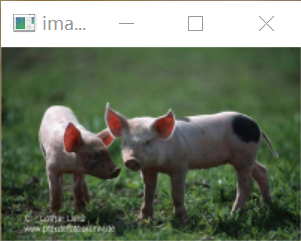
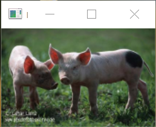

# CV-final-project
sysu CV final project

## Seam Carving
remove the seam that inserts the least energy to the image; add penalty term according to ground truth masks when calculating the energy

​original image vs seam carved image (scale=0.85):

  

