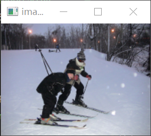
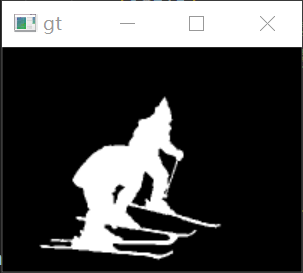
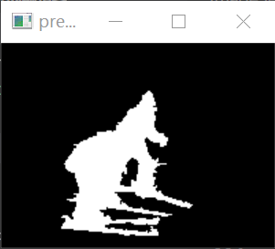

# 计算机视觉期末大作业

[TOC]


## 第一题：Seam Carving

### 问题描述

结合 “Lecture 6 Resizing“ 的 Seam Carving 算法，设计并实现前景保持的图像缩放，前景由 gt 文件夹中对应的标注给定。要求使用“Forward Seam Removing”机制，X，Y 方向均要进行压缩。压缩比例视图像内容自行决定（接近 1-前景区域面积/（2*图像面积）即可）。每一位同学从各自的测试子集中任选两张代表图，将每一步的 seam removing 的删除过程记录，做成 gif 动画格式提
交，测试子集的其余图像展示压缩后的图像结果。

### 求解过程

#### 求最小接缝

根据Lecture 6，Forward Seam Removing 对应的状态转移方程为：

<div align=center>

根据公式的结构，我们在计算最小接缝`min_seam`时先给出如下几个变量：

```python
del1 = abs(int(img[i, j+1]) - int(img[i, j-1]))
del2 = abs(int(img[i-1, j]) - int(img[i, j-1]))
del3 = abs(int(img[i-1, j]) - int(img[i, j+1]))
v1 = M[i-1, j-1] + del1 + del2
v2 = M[i-1, j] + del1
v3 = M[i-1, j+1] + del1 + del3
```

注意到如果期望遍历整个图像，可以令`i`取1到图像总行数；而由于我们按列方向求接缝，`j`必须取0到总列数的范围，所以我们需要对边界情况做特殊处理。当处理左边界时，`j=0`，取三个方向为`j=j, j=j+1, j=j+2`；当处理右边界时，`j=n-1`（n即图像总列数），取三个方向为`j=j-2, j=j-1, j=j`。具体相关处理代码在此不作赘述。

按行按列遍历整个图像，为每一个位置`[i,j]`计算上述`v1, v2, v3`，并取其中最小值作为`M[i,j]`即可；同时，为了能够回溯找到具体的接缝路径，我们还需要将`v1, v2, v3`所对应的上一行像素的列索引存储到`backtrack[i, j]`中，具体代码如下：

```python
M[i, j] = min(v1, v2, v3)
if v1 == min(v1, v2, v3):
	backtrack[i, j] = j-1
elif v2 == min(v1, v2, v3):
	backtrack[i, j] = j
else:
	backtrack[i, j] = j+1
```

遍历完整个图像后，`M`的最后一行就存储有每一个列方向的接缝删除后将为图像带来的新增能量值，`backtrack`则从下往上存储了每个列方向接缝的具体路径。

#### 前景保持

为了实现前景保持，可以在计算`M[i, j]`时查询`gt_img`（前景蒙版），如果`gt_img[i, j]`为0，则`[i, j]`在图像上非前景，而当`gt_img[i, j]`为255时，`[i, j]`在图像上为前景，我们可以给`M[i, j]`加上一个惩罚项，令像素`[i, j]`所参与计算出的接缝在删除接缝时优先级尽可能低。

```python
v1 = M[i-1, j-1] + del1 + del2 + gt_penalty(i-1, j-1, gt_img)
v2 = M[i-1, j] + del1 + gt_penalty(i-1, j, gt_img)
v3 = M[i-1, j+1] + del1 + del3 + gt_penalty(i-1, j+1, gt_img)
```

#### 删除接缝

如前面“求最小接缝”一节所说，我们可以找到`M`最后一行上的最小值的列索引`j`，从`backtrack[-1, j]`开始回溯，直到`j=0`时就能找到这条图像中最优的待删除接缝。具体的删除过程可以通过一个蒙版实现，需要删除的像素置为`False`即可。需要注意的是，作为前景保持的参考，`gt_img`也要和原图像同时进行接缝删除，从而保证`gt_img`中白色像素与原图像中的前景像素总是一一对应的。

```python
def seam_carving(img, gt_img):
    m, n, _ = img.shape
    # 求最小接缝
    M, backtrack = min_seam(cv2.cvtColor(img, cv2.COLOR_BGR2GRAY), gt_img)
    mask = np.ones((m, n), dtype=bool)
    # 找到最优接缝
    j = np.argmin(M[-1])
    for i in reversed(range(m)):
        mask[i, j] = False
        j = backtrack[i, j]
    # 从gt_img中删除接缝
    gt_img = gt_img[mask].reshape((m, n-1))
    # 从原图像的三通道中删除接缝
    mask = np.stack([mask] * 3, axis=2)
    img = img[mask].reshape((m, n-1, 3))
    return img, gt_img
```

#### 完整过程

前述内容介绍了如何找到并删除一条列方向的接缝，要完整地对图片进行压缩，则可以通过一个比例参数`scale`来控制具体删除多少条接缝。要删除行方向的接缝，将列方向处理完毕的图像转置后再重复处理过程即可。这部分代码对应如下：

```python
scale = 0.8

m, n, _ = img.shape
# 删除列方向接缝
for i in trange(n - int(scale * n)):
    img, gt_img = seam_carving(img, gt_img)
# 转置图像
img = cv2.transpose(img)
gt_img = cv2.transpose(gt_img)
# 删除行方向接缝
for j in trange(m - int(scale * m)):
    img, gt_img = seam_carving(img, gt_img)
# 转置图像以还原
img = cv2.transpose(img)
gt_img = cv2.transpose(gt_img)
```

### 结果展示与分析

下面展示测试子集中部分图像的处理结果。测试子集中所有图像的压缩结果可见于SeamCarving/result中。其中270.png与370.png的压缩过程gif可见于SeamCarving/result/gifs中。

将270.png压缩0.85倍：

<div align=center>

将370.png压缩0.8倍


<div align=center>

将70.png压缩0.7倍

<div align=center>

可以看到效果非常好，前景基本保持，背景中的细节也有一定的保持（如70.png的结果中背景的树），整体压缩效果非常自然，没有明显变形。

## 第二题：Graph-based image segmentation

### 问题描述

结合“Lecture 7 Segmentation”内容及参考文献[1]，实现基于 Graph-based image segmentation 方法（可以参考开源代码，建议自己实现），通过设定恰当的阈值将每张图分割为 50~70 个区域，同时修改算法要求任一分割区域的像素个数不能少于 50 个（即面积太小的区域需与周围相近区域合并）。结合GT 中给定的前景 mask，将每一个分割区域标记为前景（区域 50%以上的像素在 GT 中标为 255）或背景（50%以上的像素被标为 0）。区域标记的意思为将该区域内所有像素置为 0 或 255。要求对测试图像子集生成相应处理图像的前景标注并计算生成的前景 mask 和 GT 前景 mask 的 IOU 比例。假设生成的前景区域为 R1，该图像的 GT 前景区域为 R2，则$IOU=\frac{R1\cap R2}{R1\cup R2}$

### 求解过程

本部分实现主要参考了https://github.com/YanzuoLu/SYSU-CV中相关部分的代码。

#### 并查集

Graph-based image segmentation算法将图像用加权图抽象化表示。最初各像素点自身就是图的一个节点，计算像素点和其邻域的不相似度后将边按照不相似度进行非递减排序，并逐一判断是否符合合并条件；根据合并结果更新图，循环过程直到符合分割结束条件（分割区域为50~70个；每一个分割区域的像素个数都不少于50个）。

从前述算法基本思想中我们可以看出，基于图的图像分割算法是一个多集合问题，每一个像素就是这些集合的基本元素。并查集正是一种可以应用在这种多集合问题的数据结构，它善于处理在刚开始时将每个元素构成一个单元素集合，然后按照一定的顺序将属于同一组的元素进行合并的实际问题。

因此， 我们第一步就是封装一个并查集类`DisjointSet`，设计其初始化方法以及最重要的`find`与`join`方法。

初始化方面，一个`DisjointSet`对象的成员变量包括当前集合总数`num_sets`以及各节点信息`data`。每个节点`i`（像素）对应`data`列表的一个元素，其中存储有如下信息：

```python
self.data[i, 0] = 0 # rank，即以节点i为根的集合所表示的树的层数
self.data[i, 1] = 1 # size，即以节点i为根的集合的节点数
self.data[i, 2] = i # parent，初始化时每个parent都指向自己
self.data[i, 3] = 0 # gt label，即以节点i为根的集合中属于前景部分的像素数
```

`find_parent`方法为一个节点找到其父节点，同时压缩路径：

```python
def find_parent(self, idx):
	parent = idx
	while parent != self.data[parent, 2]:
		parent = self.data[parent, 2]
	self.data[idx, 2] = parent
	return parent
```

`join`方法基于`rank`将两个集合合并：

```python
def join(self, idx1, idx2):
	if self.data[idx1, 0] > self.data[idx2, 0]:
		# idx1作为新集合的根
		self.data[idx2, 2] = idx1
		self.data[idx1, 1] += self.data[idx2, 1]
	else:
		# idx2作为新集合的根
		self.data[idx1, 2] = idx2
		self.data[idx2, 1] += self.data[idx1, 1]
		if self.data[idx1, 0] == self.data[idx2, 0]:
			# 若idx1的集合与idx2的集合rank相等，则新集合rank需加一
			self.data[idx2, 0] += 1
    self.num_sets -= 1
```

#### 不相似度

并查集中各边的权值由区域间的不相似度决定。对于与像素一一对应的基本节点，可以通过如下公式计算两个像素之间的不相似度：
$$
D(p_1, p_2)=\sqrt{(p_1-p_2)^2}
$$
具体代码实现为：

```python
def calc_dist(p1, p2):
    diff = (p1 - p2) ** 2
    return np.sqrt(np.sum(diff))
```

#### 将图像建模为图

图像是像素的集合，要应用基于图的图像分割算法，首先应该将图像建模为图。本实现使用的是四连通的建模方式，即将一个像素视为节点时，只有其上、下、左、右四个方向的像素会与其形成边。具体的建模过程为，遍历整个图像，将每一个像素以及它的右邻居/下邻居的索引存储到边的顶点列表中，并计算两顶点之间的不相似度，存储到边的权值列表中：

```python
for i in range(m):
	for j in range(n):
		# 生成四连通的边
		if j < n - 1:
			edges_v.append(np.array([i*n+j, i*n+(j+1)]))
			edges_dist.append(calc_dist(img[i, j], img[i, j+1]))
		if i < m - 1:
			edges_v.append(np.array([i*n+j, (i+1)*n+j]))
			edges_dist.append(calc_dist(img[i, j], img[i+1, j]))
```

#### 图像分割

下面结合前述内容介绍完整的图像分割过程。首先将图像建模为图，并初始化并查集。接着遍历图的每一条边进行集合合并，对于不相交的两个集合（根节点不同），查看两个根节点之间的不相似度是否低于阈值，若低于阈值，表示两集合“足够相似”，可以合并：

```python
# 遍历每一条边进行集合合并
for i in range(len(edges_v)):
	v1_parent = djs.find_parent(edges_v[i, 0])
	v2_parent = djs.find_parent(edges_v[i, 1])
	# 对两个不相交的集合，查看是否可以合并
	if (v1_parent != v2_parent):
		# 查看两集合是否足够相似
		if (edges_dist[i] <= threshold[v1_parent]) and (edges_dist[i] <= threshold[v2_parent]):
			djs.join(v1_parent, v2_parent)
			v1_parent = djs.find_parent(v1_parent)
			# 更新不相似度阈值
			threshold[v1_parent] = edges_dist[i] + k / djs.data[v1_parent, 1]
```

接着重复遍历所有边，消除所有过小的分割区域。如果某区域中的像素个数小于50，则将其与邻近的集合合并：

```python
while(True):
	flag = False
	# 遍历所有边，消除过小分割区域
	for i in range(len(edges_v)):
		v1_parent = djs.find_parent(edges_v[i, 0])
		v2_parent = djs.find_parent(edges_v[i, 1])
		# 如果这一边上两集合中有一个集合的像素过少，合并
		if (v1_parent != v2_parent) and ((djs.data[v1_parent, 1] < min_pixels) or (djs.data[v2_parent, 1] < min_pixels)):
			djs.join(v1_parent, v2_parent)
			flag = True
	if not flag:
		break
```

#### 标记前景区域并生成结果

经过前述过程，并查集`djs`完成图像分割任务。接下来可以通过对照前景蒙版`gt_img`来遍历所有像素，将每一个像素是否属于前景都记录在`djs`的区域根节点中，在根节点`i`的`data[i, 3]`存储这一区域中属于前景的像素个数：

```python
# 对照前景蒙版gt_img标记出前景区域
for i in range(m):
	for j in range(n):
		if gt_img[i, j] > 127:
			djs.data[djs.find_parent(i*n+j), 3] += 1
```

最后，再次遍历所有像素，绘制前景区域分割的结果图像`predict`。对于每一个像素，查询其所在的区域的根节点，如果根节点的`data`记录中，属于前景的像素个数占集合的像素个数过半，那么认为这一区域属于前景，即可以在`predict`中绘制出这一像素：

```python
predict = np.zeros((m, n))
for i in range(m):
	for j in range(n):
		parent = djs.find_parent(i*n+j)
		# 如果有过半数像素都在前景中，认为这一区域属于前景区域
		if djs.data[parent, 3] / djs.data[parent, 1] >= 0.5:
			predict[i, j] = 255
```

#### 计算IOU

得到最终分割结果图像`predict`后，可以遍历其中像素，查看每一个像素是否属于gt的前景。使用计数器`intersect`以及`union`，前者用来计数同时属于`predict`前景和gt前景的像素，后者用来计数所有在`predict`或gt中位于前景位置的像素。最后IOU的值就是`intersect`与`union`的比值：

```python
intersect = 0
union = 0

for i in range(m):
    for j in range(n):
        if predict[i, j] > 127:
            union += 1
            if gt_img[i, j] >127:
                intersect += 1
        else:
            if gt_img[i, j] > 127:
                union += 1

print("IOU = ", float(intersect) / union)
```

### 结果展示与分析

取不相似度阈值为100，区域最小像素数50，270.png的结果如下面最右图所示，中间图像为gt：

<div align=center> 

同样参数，370.png的结果如下图：

<div align=center>

取不相似度阈值为80，区域最小像素数50，770.png的结果如下图：

<div align=center> 

其他图像的分割结果（IOU值，保留四位小数）如下表所示，不相似度阈值基本为80左右，区域最小像素数为50：

| 图像    | IOU    |
| ------- | ------ |
| 70.png  | 0.6352 |
| 170.png | 0.6098 |
| 270.png | 0.8194 |
| 370.png | 0.7856 |
| 470.png | 0.9059 |
| 570.png | 0.4717 |
| 670.png | 0.6668 |
| 770.png | 0.8499 |
| 870.png | 0.7514 |
| 970.png | 0.6748 |

从以上数据与结果图像可以看出，本方法的前景分割准确率总的来说在60%到70%左右。由于采用四连通的方式分割区域，一些较细小的斜方向区域并不能很好地识别，如370.png的结果所示。在测试子集的数据中我们也注意到，570.png的结果尤其不理想，这可能是因为前景部分内容过小，背景内容较单一导致的，一些前景内容被轻易地合并到了背景中（尤其最左的蓝色衣物）：

<div align=center>  

## 第三题：区域预测

### 问题描述

从训练集中随机选择 200 张图用以训练，对**每一张图提取归一化RGB颜色直方图**（8\*8\*8=512 维），同时**执行问题 2 对其进行图像分割**（分割为 50~70个区域），对得到的**每一个分割区域提取归一化 RGB 颜色直方图特征**（维度为8\*8\*8=512），将每一个区域的**颜色对比度特征**定义为区域颜色直方图和全图颜色直方图的拼接，因此区域颜色区域对比度特征的维度为 2*512=1024 维，采用**PCA 算法对特征进行降维取前 20 维**。利用选择的 200 张图的所有区域（每个区域 20 维特征）构建**visual bag of words dictionary**（参考 Lecture 12. Visual Bag of Words 内容），单词数（聚类数）设置为 50 个，visual word 的特征设置为聚簇样本的平均特征，每个区域降维后颜色对比度特征（20 维）和各个 visual word的特征算点积相似性得到 50 个相似性值形成 50 维。将得到的 50 维特征和前面的 20 维颜色对比度特征拼接得到每个区域的 70 维特征表示。根据问题 2，每个区域可以被标注为类别 1（前景：该区域 50%以上像素为前景）或 0（背景：该区域 50%以上像素为背景），选用任意分类算法（SVM，Softmax，随机森林，KNN等）进行学习得到分类模型。最后在测试集上对每一张图的每个区域进行测试（**将图像分割为 50~70 个区域，对每个区域提取同样特征并分类**），根据测试图像的GT，分析测试集区域预测的准确率。

### 求解过程

#### 提取图像的归一化颜色直方图

由题意可知，我们要使用一个8\*8\*8的矩阵来存储图像与区域的像素颜色统计信息，RGB图像的颜色量化为0~255，因此我们要进一步将[0, 255]量化到[0, 7]，比例系数为32（256 / 8 = 32）。遍历图像，对每一个像素的三通道分量各除以比例系数32即可得到各分量值在直方图中的bin：

```python
def calc_RGBHist(img, mask):
    m, n, _ = img.shape
    hist = np.zeros((8, 8, 8))
    for i in range(m):
        for j in range(n):
            if mask is None or mask[i, j] == 255:
                b = int(np.floor(img[i, j, 0] / 32))
                g = int(np.floor(img[i, j, 1] / 32))
                r = int(np.floor(img[i, j, 2] / 32))
                hist[b, g, r] += 1
    return hist
```

#### 提取图像分割区域的归一化颜色直方图

在`calc_RGBHist`方法中，还有一个参数`mask`，当`mask`为`None`时，`calc_RGBHist`计算整个图像的直方图，而当`mask`非`None`时，只有`mask`上值为255的像素会参与到颜色直方图的计算中。

`mask`的设计是为了能够具体地计算每一个图像分割区域的颜色直方图。因此`mask`的生成是和图像分割结果有关的。对于一个特定的区域（像素集合），给出并查集中此集合的根节点`parent`，遍历所有像素，如果某像素的父节点为`parent`，那么就将正在处理的`mask`上对应位置置为白色（255）：

```python
def gen_region_mask(img, djs, parent):
    m, n, _ = img.shape
    mask = np.zeros((m, n))
    for i in range(m):
        for j in range(n):
            if djs.find_parent(i*n+j) == parent:
                mask[i, j] = 255
    return mask
```

一些`mask`的图像如下所示：

<div align=center>

#### 生成区域颜色对比度特征及前景标签

区域的颜色对比度特征定义为区域颜色直方图与图像颜色直方图的拼接，因此我们可以先计算出图象的颜色直方图，再一个个生成区域颜色直方图。遍历所有像素，维护一个`processed`列表，`processed`列表中记录有所有区域根节点的索引；对一个遍历到的像素，在并查集中查询其父节点，如果其父节点不在`processed`中，则此像素所在区域尚未被处理。对未处理的区域计算颜色直方图，并与全图颜色直方图拼接，再将区域根节点放入`processed`中；查询并查集，类似第二题，根据处于真实前景中的像素数目占比来判断区域是否是前景区域，若是，为此区域标记前景标签（此后用于有监督学习）。这部分代码如下所示：

```python
def gen_region_features(img, djs):
    label = []
    processed = []
    region_features = []
    # 求图像颜色直方图
    img_feature = calc_RGBHist(img, None)
    m, n, _ = img.shape
    for i in range(m):
        for j in range(n):
            parent = djs.find_parent(i*n+j)
            # 对未处理区域
            if parent not in processed:
                # 求区域蒙版
                mask = gen_region_mask(img, djs, parent)
                # 求区域颜色直方图
                feature = calc_RGBHist(img, mask)
                # 求颜色对比度特征
                region_features.append(np.hstack([feature, img_feature]))
                processed.append(parent)
                # 生成前景标签
                if djs.data[parent, 3] / djs.data[parent, 1] >= 0.5:
                    label.append(1)
                else:
                    label.append(0)
    return region_features, label
```

#### 采用PCA算法对特征降维

调用`sklearn.decomposition`中的`PCA`，将前面得到的区域颜色对比度特征降维，只提取前20维作为代表：

```python
print("conducting pca...")
pca = PCA(n_components=20)
pca_features = pca.fit_transform(features)
```

#### 构建visual words

利用`sklearn`的K-means相关算法模块完成visual words的构建（聚类），设置单词数为50：

```python
print("clustering word bags...")
kmeans = KMeans(n_clusters=50).fit(pca_features)
cluster_centers = kmeans.cluster_centers_
kmeans_features = np.matmul(pca_features, cluster_centers.T)
```

#### 使用SVM进行学习分类

利用`sklearn`的SVM相关模块完成训练学习与分类。训练数据来自data/imgs中随机的200个图像，利用这200个图像与它们对应的前景蒙版gt完成特征与标签的生成后就可以调用训练模块：

```python
print("training SVM...")
features = np.hstack([pca_features, kmeans_features])
clf = make_pipeline(StandardScaler(), SVC(gamma='auto'))
clf.fit(features, gt_labels)
```

#### 在测试子集上测试

对于测试子集，同样计算所有测试集中所有图像的特征，降维并与visual words进行点积，作为输入令分类器进行预测；得到预测的标签结果后，与前面生成的真实标签进行比对，输出准确率完成测试。

```python
# 生成测试集特征与真实标签
t_features = []
t_gt_labels = []
for i in range(test_img_list.size):
    t_img = cv2.imread(test_img_list[i])
    t_gt_img = cv2.imread(test_gt_list[i], cv2.IMREAD_GRAYSCALE)
    _, djs = seg.segmentation(t_img, t_gt_img, 80, 50)
    f, l = gen_region_features(t_img, djs)
    t_features.extend(f)
    t_gt_labels.extend(l)
# 特征降维，计算聚类相似度
t_pca_features = pca.transform(t_features)
t_kmeans_features = np.matmul(t_pca_features, cluster_centers.T)
t_features = np.hstack([t_pca_features, t_kmeans_features])
# 预测
true_predict = 0
predict_labels = clf.predict(t_features)
# 计算准确率
for i, label in enumerate(t_gt_labels):
    if predict_labels[i] == label:
        true_predict += 1
```

### 结果展示与分析

运行结果如下图，测试集上的准确率可以达到91%，可以称得上是理想。从输出也可以看到，生成训练集特征的运行时间较长（需要22分钟），这与反复遍历同一图像的所有像素有关。


## 第四题：PCA图像压缩

### 问题描述

结合“Lecture 10. Dimensionality Reduction”中学习的方法，每一位同学从各自的测试子集中任选一张代表图，执行 PCA 压缩。先将图片尺寸缩放或裁减为 12的倍数，以 12*12 patch 为单位执行 PCA 压缩，1）展示 16 个最主要的特征向量的可视化图，2）展示 144D，60D，16D 和 6D 的压缩结果。需要介绍算法流程和对应的结果展示。

### 求解过程

#### 生成数据

由题意，以12\*12patch为单位执行PCA压缩，将一个patch视作一个144维的向量，则首先需要从图像构造一个由144维向量构成的矩阵`X`。

将待压缩图像的长宽裁剪为12的倍数，计算行方向patch的数量`pm`与列方向patch的数量`pn`，将`X`初始化为`(pm*pn, d*d)`的矩阵，其中`d=12`，将源图像中每一个12\*12的patch依次填入其中；即，我们要压缩的数据是`pm*pn`条`d*d`维的数据，每一条都来自原图像的一个patch：

```python
X = np.zeros((pm * pn, d * d))
idx = 0
for i in range(pm):
    for j in range(pn):
        vec = np.array(img[i*d : (i+1) * d, j*d : (j+1) * d])
        #cv2.imshow('part', cv2.resize(vec, (d*10, d*10)))
        X[idx] = vec.reshape(d * d)
        idx += 1
```

#### PCA降维

根据Lecture10中的算法，PCA的步骤有如下6步：

1. 将原始数据按列组成n行m列的矩阵X
2. 将X每一行进行零均值化
3. 求X的协方差矩阵C
4. 求C的特征值与对应特征向量
5. 将特征向量按特征值大小从上到下按行排列成矩阵，取前k行组成矩阵P
6. Y=PX即降维到k维后的数据

前面生成数据一节提到，已经得到的`X`是一个`(pm*pn, d*d)`的矩阵，因此第一步实际上就是将`X`转置，这一步可以在调用`pca`之前完成：

```python
P, Y = pca(X.T, k)
```

其余步骤在`pca`方法中完成。第二步将`X`每一行零均值化：

```python
m, n = X.shape
mean = []
for i in range(m):
	mean.append(np.mean(X[i]))
	for j in range(n):
		X[i, j] -= mean[i]
```

第三步第四步，求协方差矩阵`C`以及`C`的特征值与对应特征向量：

```python
C = 1 / n * np.matmul(X, X.T)
eigen_val, eigen_vec = np.linalg.eig(C)
```

第五步，先找到前k大特征值在列表`eigen_val`中的索引`k_vec_idx`，再利用`k_vec_idx`直接从`eigen_vec`中获得`P`；需要注意的是`eigen_val`中以列的形式存储特征向量，因此得到的`P`也是按列表示特征向量的，在进行下一步运算之前需要进行转置：

```python
idx = np.argsort(eigen_val)
k_vec_idx = idx[:-(k+1):-1]
P = eigen_vec[:, k_vec_idx]
P = np.transpose(P)
```

第六步，求`P`与`X`的矩阵乘积得到`Y`。易知`Y`的形状为`(k, pm*pn)`，`d*d`维的数据降维到了`k`维。接下来我们还需要将数据转换回到原空间，即`X`的`(d*d, pm*pn)`，因此再次用`P`与`Y`求矩阵乘积，并将前面`X`零均值化时减去的平均值加回来：

```python
Y = np.matmul(P, X)
Y = np.matmul(P.T, Y)
for i in range(m):
	for j in range(n):
		Y[i, j] += mean[i]
```

至此，我们已经得到了压缩后的图像`Y`以及前`k`重要的特征向量构成的矩阵`P`。要将它们可视化，还需要进行一步rescale，将他们的元素值映射到灰度图像素取值的[0, 255]范围上。进行这一操作的`rescale_img`方法代码如下：

```python
def rescale_img(img):
    m, n = img.shape
    max = img.max()
    min = img.min()
    # 如果最小值小于零，先将数据平移
    if min < 0:
        for i in range(m):
            for j in range(n):
                img[i, j] += -min
        max = img.max()
        min = 0
    # 比例常数
    scale = 255 / (max - min)
    for i in range(m):
        for j in range(n):
            # 强制类型转换为整数
            img[i, j] = int(np.floor(img[i, j] * scale))
    return img
```

对`P`与`Y`进行rescale操作后，就可以将它们返回了。为了保持维数的一致，`pca`返回`Y`的转置矩阵，即`(pm*pn, d*d)`的矩阵。

#### 重建图像

前述PCA过程得到了一个`(pm*pn, d*d)`的降维后的数据矩阵`Y`，接下来我们需要从`Y`中按行取出向量，将`d*d`的向量还原为`d*d`的图像patch，从而重建图像：

```python
result = np.zeros((m, n))
idx = 0
for i in range(pm):
    for j in range(pn):
        result[i*d : (i+1) * d, j*d : (j+1) * d] = Y[idx].reshape((d, d))
        idx += 1
```

这一过程本质上也是前面生成`X`的逆过程。至此，我们就得到了压缩后的图像`result`。

至于特征向量的可视化，前面已经将`P`的元素值rescale到了灰度图的像素值范围，因此只需简单地访问`P`的各行，并将每一行上`d*d`的数据reshape为`d*d`的二维矩阵并生成图像即可。

### 结果展示与分析

对270.png进行实验，以12*12patch为单位执行PCA压缩时16个最主要的特征向量的可视化图如下（对应特征值大小与从左到右从上到下的图片排列顺序对应，为了便于观察，各向量的大小已从12\*12放大至120\*120）：


可以观察到较为“平缓”的特征向量在图像中的占比更大，对应图像中较大面积的背景等低频成分；占比更小的特征向量对应图像中的细节等高频成分。

144D的压缩结果与原图对比如下（左图为原图，右图为压缩结果）：

<div align=center>

60D的压缩结果与原图对比如下（左图为原图，右图为压缩结果）：

<div align=center>

16D的压缩结果与原图对比如下（左图为原图，右图为压缩结果）：

<div align=center>

6D的压缩结果与原图对比如下（左图为原图，右图为压缩结果）：

<div align=center>

从以上结果我们可以很明显地看到，维数降低时重建图像的误差越大，丢失的信息越多，压缩程度也越高；但同样值得一提的是，即使是6D的情况，我们还是可以从压缩图像中明显看出两只小猪，这一定程度上能够说明PCA算法保留图像主成分是很有效果的。
